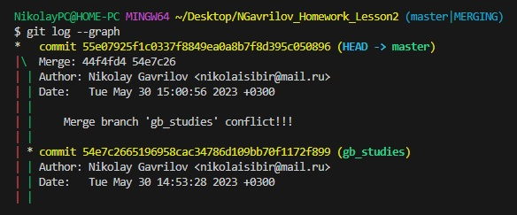

# Мой отпуск 

## Поехать на дачу

Дача - место **силы и покоя**. Тишина, свежий воздух, умиротворение ~~от слияния с бесконечно вечным~~.

### Дачные планы:
* Must-do-вещи для отдыха:
    * Искупаться в озере
    * Пожарить шашлык
    * Сходить за грибами
* Хозяйственные работы:
    * Починить забор
    * Натянуть плёнку на парник
    * Посадить то, что еще не посажено
---

## Сыграть свадьбу

Свадьба - главное событие этого лета, к которому мы с девушкой давно шли.
До самого торжества необходимо завершить все приготовления: 
1. Купить кольца
2. Купить костюм и платья
3. Не потратить сбережения, собрать оставшуюся сумму
4. Заплатить
    1. Ведущему
    2. Фотографу
    3. За банкет
5. Закупить алкоголь
6. Завершить прочие дела
---

## Добиться новых успехов в творческих начинаниях

Я уже давно разрабатываю фанатскую сюжетную модификацию к известной визуальной новелле *"Бесконечное лето"* на движке RenPy. Этим летом мне стоит продолжить работу, чтобы не заставлять читателей долго ждать. 

Помимо сюжета я работаю над визуалом, создавая его в Adobe Photoshop, и над кодом. 

Пример кода: 
```
label zhoha_prologue:  
    stop music 
    window hide
    $ persistent.sprite_time = 'day'
    $ day_time()
    play sound vzhuh
    scene zhoha_transition
    show zhoha_prologue
    show tlk normal pioneer at center with moveinleft
    $ renpy.pause(8)
    $ save_name = ('Мгновения вечности. Пролог')
    play music emporiogwinn fadein 2
    scene zhohafon with dissolve     
    "Наступает момент, когда житейские простые невзгоды становятся чем-то совсем незначительным перед лицом грядущей катастрофы."
```
Еще пример:
```
label zhoha_menu:
    play music daredevilgm fadein 2
    call screen zhoha_menu
    screen zhoha_menu:
        tag test
        modal True
        
        imagemap: 
            ground "mods/zhoha/img/menu/zhohamenu_background.jpg"
            idle  "mods/zhoha/img/menu/zhohamenu_idle.png"
            hover  "mods/zhoha/img/menu/zhohamenu_hover.png"
            
            hotspot(86,190,352,273) action (OpenURL("https://steamcommunity.com/sharedfiles/filedetails/?id=1570626647")) hovered (Play("sound","mods/zhoha/sound/snd/switch.ogg")) unhovered (Play("sound","mods/zhoha/sound/snd/nothing.ogg"))
            hotspot(23,470,490,290) action (OpenURL("https://steamcommunity.com/sharedfiles/filedetails/?id=2085658392")) hovered (Play("sound","mods/zhoha/sound/snd/switch.ogg")) unhovered (Play("sound","mods/zhoha/sound/snd/nothing.ogg"))
            hotspot(1431,494,460,84) action (Hide("zhoha_menu"),Jump("zhoha_start")) hovered (Play("sound","mods/zhoha/sound/snd/switch.ogg")) unhovered (Play("sound","mods/zhoha/sound/snd/nothing.ogg"))
            hotspot(1469,627,383,82) action (Hide("zhoha_menu"),Jump("zhoha_titles")) hovered (Play("sound","mods/zhoha/sound/snd/switch.ogg")) unhovered (Play("sound","mods/zhoha/sound/snd/nothing.ogg"))
            hotspot(1487,785,355,80) action (Hide("zhoha_menu"),Jump("zhoha_return")) hovered (Play("sound","mods/zhoha/sound/snd/switch.ogg")) unhovered (Play("sound","mods/zhoha/sound/snd/nothing.ogg"))
            hotspot(114,926,109,109) action (OpenURL("https://vk.com/blackravenficbook")) hovered (Play("sound","mods/zhoha/sound/snd/switch.ogg")) unhovered (Play("sound","mods/zhoha/sound/snd/nothing.ogg"))
            hotspot(262,926,111,111) action (OpenURL("https://steamcommunity.com/sharedfiles/filedetails/?id=2788713508")) hovered (Play("sound","mods/zhoha/sound/snd/switch.ogg")) unhovered (Play("sound","mods/zhoha/sound/snd/nothing.ogg"))
```
Это всё, конечно, хорошо, но я способен на большее. Для этого мне пригодятся новые знания, которые я получу в процессе учебы в GeekBrains. Хочется, чтобы мое новое творение произвело на читателей __вау-эффект__!

---

## Продолжить учиться в GeekBrains
Учеба в сфере ИТ - залог моего будущего! 

Мне важно продолжать учёбу и осваивать новую профессию благодаря курсу на платформе GeekBrains. Это поможет мне в обозримом будущем найти востребованную работу, обрести уверенность в себе и выбраться из финансового кризиса.

---

Примечание для преподавателя:
1. Похоже, сделал лишний коммит между слиянием веток, поэтому в дереве при команде git log --branch отображаются только последние слитые ветки. 

2. Планировал сделать в работе два конфликта. 
    1. Первый - из-за разных заголовков третьего пункта отпуска (в ветке master и в ветке creativity). Конфликт сделать не удалось, видимо, различия должны быть не в заголовках, а непосредственно в текстовом теле подпункта и ветки.
    2. Второй - из-за разного текстового наполнения в ветке master и в ветке gb_studies. Конфликт вызван и устранён успешно.
